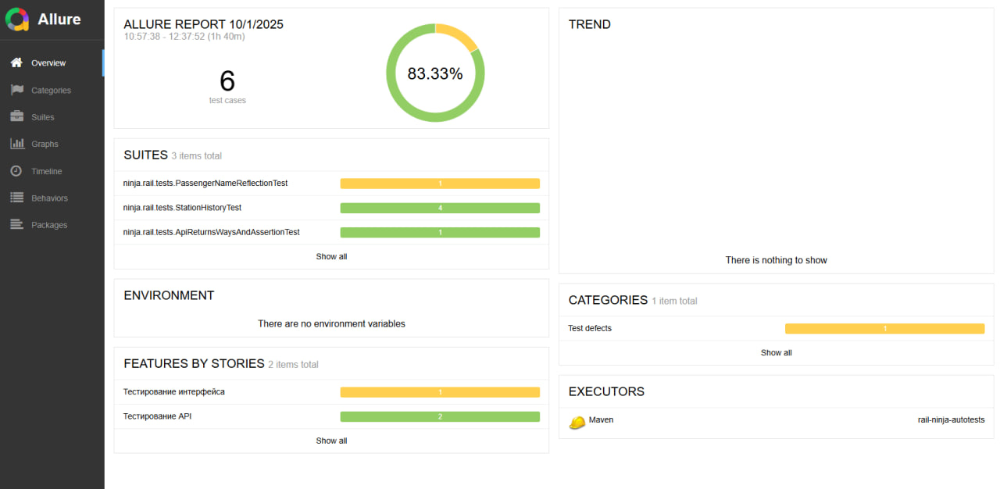
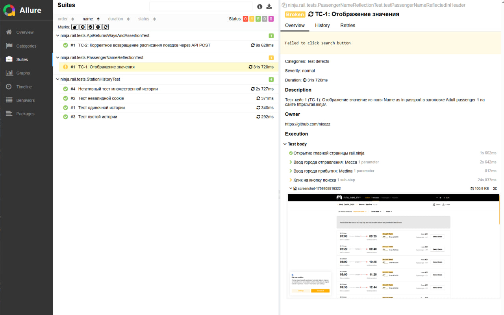

# Rail.Ninja Tests Framework


### Данный проект представляет собой тестовый фреймворк для автоматизации тестирования **UI** и **API** веб-сайта [rail.ninja](https://rail.ninja).  
_Проект является тестовым заданием._






### 💻 Используемые инструменты и технологии
- **Java 17**
- **Apache Maven**
- **Selenium**
- **JUnit 5**
- **Rest Assured**
- **Allure Report**
- **Logback**

---

## 🔒 Требования перед установкой и запуском
Перед началом убедитесь, что на вашем устройстве установлены:
1. **Java 17**
2. **Apache Maven**
3. **Chrome WebDriver**
4. **Git**


> Для выполнения UI тестов используется браузер **Google Chrome** и драйвер **Chrome WebDriver**.  
💡 Установить веб-драйвер можно по [ссылке](https://chromedriver.storage.googleapis.com/index.html?path=114.0.5735.90/).


---

## 🔧 Установка и запуск

### 1. Клонирование репозитория
```cmd
git clone https://github.com/nixezz/rail-ninja-autotests.git 
```
### 2. Переход в каталог проекта
```cmd
cd your-repo-name
```
### 3. Скачивание зависимостей
```cmd
mvn clean install
```
### 4. Запуск тестов
```cmd
mvn test
```
### 5. Генерация отчета тестов Allure
```cmd
mvn allure:report
```
После выполнения тестов отчеты Allure создаются в папке `target/allure-results`.


### 6. Просмотр отчетов Allure
```cmd
mvn allure:serve
```
---
